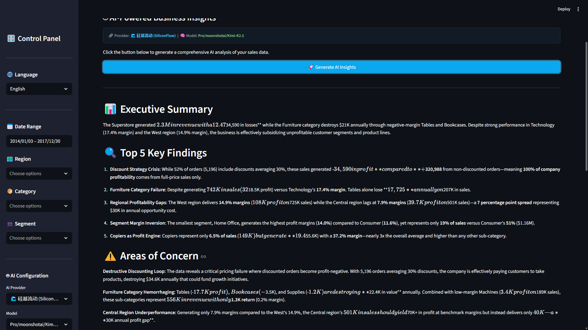

# 📊 AI-Powered Sales Analytics Platform

**Enterprise BI Solution with Predictive Analytics, Natural Language Query & Multi-Language Support**

[Streamlit](https://streamlit.io)
[Python](https://python.org)
[OpenAI](https://openai.com)
[i18n](locales/)
[License](LICENSE)

[中文文档](README.zh-CN.md)


## 💼 Business Value

> *"We reduced our weekly reporting workload from 4 hours to 5 minutes, and now every team member can query sales data without knowing SQL."*

### Who Is This For?

| Audience                 | Pain Point                       | How This Helps                                   |
| ------------------------ | -------------------------------- | ------------------------------------------------ |
| **Retail Businesses**    | Manual reporting, no forecasting | Automated dashboards + predictions               |
| **Sales Managers**       | Can't self-serve data            | Natural language query in English/Chinese        |
| **C-Suite / Executives** | Need strategic insights fast     | AI-generated executive reports                   |
| **Startups**             | Can't afford $50K BI tools       | Production-quality analytics at fraction of cost |

### Measurable Impact

| Metric              | Before                  | After                     | Improvement        |
| ------------------- | ----------------------- | ------------------------- | ------------------ |
| Report Generation   | 4+ hours/week           | < 5 minutes               | **98% faster**     |
| Technical Barrier   | SQL + Excel required    | Natural language          | **Zero**           |
| Forecast Capability | None                    | 3-12 month predictions    | **New capability** |
| BI Tool Cost        | $500-2,000/mo           | Open source + \~$5/mo API | **90%+ savings**   |
| Insight Turnaround  | Days (wait for analyst) | Instant (self-serve)      | **Real-time**      |

***

## ✨ Features


### 📊 Interactive Dashboard

- 8 KPI cards with real-time metrics
- 15+ interactive chart types (Plotly)
- Geographic sales heatmap (US states)
- Multi-dimensional filtering
- Year-over-year comparisons
- Discount impact analysis

### 🤖 AI Intelligence Layer

- One-click executive insight reports
- Natural language data querying
- Multi-provider: OpenAI, SiliconFlow
- 10+ LLM models supported
- Auto language detection for AI responses
- Configurable prompts per language

### 🔮 Predictive Analytics

- Holt-Winters time-series forecasting
- 3/6/9/12 month predictions
- 95% confidence intervals
- MAPE & RMSE accuracy metrics
- Automatic model selection
- Visual forecast comparison

### 🌐 Enterprise-Ready Features

- BCP 47 standard i18n (JSON packs)
- Add languages with zero code changes
- Secure API key management
- Local config + frontend override
- Git-safe credential handling
- Responsive layout design

***

## 🏗️ Architecture Overview

```
┌───────────────────────────────────────────────────────────────────────┐
│                     🖥️ Frontend Layer                                 │
│                   Streamlit + Custom CSS                              │
│  ┌────────────┐ ┌────────────┐ ┌────────────┐ ┌────────────────────┐  │ 
│  │ Dashboard  │ │ Deep Dive  │ │ Regional   │ │ Products/Customers │  │  
│  └────────────┘ └────────────┘ └────────────┘ └────────────────────┘  │
│  ┌─────────────────────────┐ ┌──────────────────────────────────────┐ │
│  │ AI Insights             │ │ Forecast & Ask AI                    │ │
│  └─────────────────────────┘ └──────────────────────────────────────┘ │
├───────────────────────────────────────────────────────────────────────┤
│                     ⚙️ Business Logic                                 │
│  ┌────────────┐ ┌────────────┐ ┌────────────┐ ┌────────────────────┐  │
│  │ Data Loader│ │ Viz Engine │ │ AI Insights│ │ Forecaster         │  │
│  │ (Pandas)   │ │ (Plotly)   │ │ (OpenAI)   │ │ (statsmodels)      │  │
│  └────────────┘ └────────────┘ └────────────┘ └────────────────────┘  │
├───────────────────────────────────────────────────────────────────────┤
│                     🏗️ Infrastructure Layer                           │
│  ┌────────────┐ ┌────────────┐ ┌───────────────────────────────────┐  │
│  │ i18n       │ │ Config     │ │ Multi-Provider AI Gateway         │  │
│  │ (JSON)     │ │ Manager    │ │ OpenAI / SiliconFlow              │  │
│  └────────────┘ └────────────┘ └───────────────────────────────────┘  │
└───────────────────────────────────────────────────────────────────────┘
```

***

## 📸 Screenshots

**📊 Overview — KPI Cards + Sales Trend + Category Analysis**


**📈 Deep Dive — YoY Comparison + Discount Impact + Sub-Category Profit**


**🗺️ Regional — US Choropleth Map + Top States/Cities**


**👥 Product & Customer — Advanced Segmentation & Behavioral Analytics**


**🤖 AI Insights — GPT-Powered Executive Analysis Report**





**🔮 Forecast — Time-Series Prediction with Confidence Bands**


**🧠 Ask AI — Natural Language Query**


**🌐 Bilingual — Seamless EN/ZH Language Switching**

***

## 🚀 Quick Start

### Prerequisites

- Python 3.10+ (tested on 3.12)
- [Superstore Sales Dataset](https://www.kaggle.com/datasets/vivek468/superstore-dataset-final)

### 5-Minute Setup

```bash
# Clone & setup
git clone https://github.com/yourusername/ai-sales-analytics.git
cd ai-sales-analytics

# Environment
conda create -n sales-analytics python=3.12 -y
conda activate sales-analytics
pip install -r requirements.txt

# Data — download from Kaggle, save as:
# → data/sales_data.csv

# AI Config (optional — dashboard works without it)
cp config.yaml.example config.yaml
# Edit config.yaml with your API key

# Launch
streamlit run app.py
```

### Minimal AI Configuration

```yaml
# config.yaml
default_provider: "siliconflow"

siliconflow:
  api_key: "sk-your-key-here"
  base_url: "https://api.siliconflow.cn/v1"
  model: "Pro/deepseek-ai/DeepSeek-V3.2"
```

> 💡 All visualizations and forecasting work **without an API key**. Only AI Insights and Ask AI require one.

***

## 📁 Project Structure

```
ai-sales-analytics/
├── app.py                      # Main application entry point
├── config.yaml                 # API credentials (git-ignored)
├── config.yaml.example         # Config template
├── requirements.txt            # Dependencies
│
├── data/
│   └── sales_data.csv          # Source dataset
│
├── locales/                    # BCP 47 i18n language packs
│   ├── en.json                 # English
│   └── zh-CN.json              # Simplified Chinese
│
├── modules/
│   ├── i18n.py                 # i18n engine (JSON loader + fallback)
│   ├── config_manager.py       # Multi-provider API management
│   ├── data_loader.py          # ETL & feature engineering
│   ├── visualizations.py       # 15+ Plotly chart components
│   ├── ai_insights.py          # LLM integration layer
│   └── forecasting.py          # Holt-Winters forecasting
│
├── .streamlit/
│   └── config.toml             # Theme configuration
│
├── docs/images/                # Screenshots
└── .gitignore
```

***

## 🛠️ Tech Stack

| Layer           | Technology    | Purpose                             |
| --------------- | ------------- | ----------------------------------- |
| **UI**          | Streamlit     | Interactive web application         |
| **Charts**      | Plotly        | 15+ interactive visualization types |
| **Data**        | Pandas, NumPy | ETL, analysis, feature engineering  |
| **Forecasting** | statsmodels   | Holt-Winters exponential smoothing  |
| **AI/LLM**      | OpenAI SDK    | Multi-provider LLM integration      |
| **i18n**        | Custom engine | BCP 47 JSON language packs          |
| **Config**      | PyYAML        | Secure credential management        |

### Supported AI Providers

| Provider                     | Key Models                             | Notes                  |
| ---------------------------- | -------------------------------------- | ---------------------- |
| 🌊 **SiliconFlow**           | DeepSeek-V3.2, Kimi-K2.5, MiniMax-M2.5 | Some free-tier models  |
| 🤖 **OpenAI**                | GPT-4o, GPT-4o-mini                    | Pay-per-use            |
| 🔌 **Any OpenAI-compatible** | Custom endpoint                        | Configurable base\_url |

***

## 🌐 Internationalization

### Adding a Language (Zero Code Change)

```bash
cp locales/en.json locales/ja.json
# Edit ja.json → restart → done
```

### Current i18n Coverage

| Scope                      | Localized |
| -------------------------- | --------- |
| UI labels, buttons, titles | ✅         |
| Chart titles & axis labels | ✅         |
| KPI card labels            | ✅         |
| AI prompt templates        | ✅         |
| AI response language       | ✅         |
| Sample questions           | ✅         |
| Error messages             | ✅         |

***

## 🗺️ Roadmap

- ✅Interactive dashboard (15+ chart types)
- ✅AI-powered business insights (multi-provider)
- ✅Time-series forecasting (Holt-Winters)
- ✅Natural language data querying
- ✅Bilingual interface (EN / 中文)
- ✅Standard JSON i18n system
- ✅Secure multi-provider API management
- PDF/Excel report export
- RAG-based document Q\&A
- Multi-dataset / custom CSV upload
- User authentication & role-based access
- Streamlit Cloud / Docker deployment
- Email scheduled reports

***

## 🤝 About This Project

### Development Approach

This project was **architected and delivered** using a modern AI-augmented development workflow:

| Responsibility                            | Role                                |
| ----------------------------------------- | ----------------------------------- |
| Product vision & business requirements    | **Human (Solution Architect)**      |
| System architecture & technical decisions | **Human**                           |
| UX/UI design decisions                    | **Human**                           |
| Code implementation                       | **AI-assisted** (Claude, Anthropic) |
| Quality assurance & integration testing   | **Human**                           |
| Deployment & documentation                | **Collaborative**                   |


### About the Author

**\[Jason]** — AI Solution Architect & Technical Founder

Full-stack technical background spanning Python, Java, PHP, Vue.js, IoT, and mobile development. Former company founder with hands-on experience in product design, system architecture, and end-to-end delivery.

I help businesses turn ideas into production AI solutions — from initial architecture through deployment.

**Specialties:** AI/LLM Integration · Data Analytics & BI · IoT Systems · Full-Stack Architecture

[Email](mailto:wojingchen@gmail.com)

***

## 📄 License

MIT License — see [LICENSE](LICENSE).

**Data:** [Superstore Sales Dataset](https://www.kaggle.com/datasets/vivek468/superstore-dataset-final) (Kaggle/Tableau, educational use).

***

**Architected with strategic vision. Delivered with AI-augmented efficiency. ⚡**

[⬆ Back to Top](#-ai-powered-sales-analytics-platform)
