# 📊 AI 智能销售分析平台


**集成预测分析、自然语言查询与多语言支持的企业级 BI 解决方案**

[](https://streamlit.io)
[](https://python.org)
[](https://openai.com)
[](locales/)
[](LICENSE)

[English](README.md)


## 💼 商业价值

> *"我们将每周的报表工作从 4 小时缩短到 5 分钟，现在团队每个人都能自己查询销售数据，无需懂 SQL。"*

### 适用场景

| 用户群体 | 痛点 | 解决方案 |
|----------|------|----------|
| **零售企业** | 手动做报表、无法预测 | 自动化看板 + 销售预测 |
| **销售经理** | 无法自助查数据 | 中英文自然语言查询 |
| **管理层** | 需要快速获取战略洞察 | AI 自动生成分析报告 |
| **创业公司** | 买不起 BI 工具 | 以极低成本获得专业级分析 |

### 可量化的效果

| 指标 | 改造前 | 改造后 | 提升幅度 |
|------|--------|--------|:--------:|
| 报表生成 | 每周 4+ 小时 | < 5 分钟 | **提速 98%** |
| 技术门槛 | 需要 SQL + Excel | 自然语言提问 | **零门槛** |
| 预测能力 | 无 | 3-12 个月预测 | **全新能力** |
| BI 工具成本 | $500-2,000/月 | 开源 + ~$5/月 API | **节省 90%+** |
| 洞察获取 | 数天（等分析师） | 即时（自助） | **实时** |

---

## ✨ 功能特性

<table>
<tr>
<td width="50%">

### 📊 交互式仪表盘
- 8 个 KPI 实时指标卡片
- 15+ 交互式图表类型（Plotly）
- 美国各州销售热力地图
- 多维度筛选过滤
- 年度同比对比分析
- 折扣影响分析

</td>
<td width="50%">

### 🤖 AI 智能分析层
- 一键生成管理层洞察报告
- 自然语言数据查询
- 多服务商：OpenAI、硅基流动
- 10+ 大模型可选
- AI 自动适配回复语言
- 按语言定制提示词

</td>
</tr>
<tr>
<td>

### 🔮 预测分析
- Holt-Winters 时间序列预测
- 3/6/9/12 个月预测周期
- 95% 置信区间
- MAPE 与 RMSE 精度指标
- 自动模型选择
- 可视化预测对比

</td>
<td>

### 🌐 企业级特性
- BCP 47 标准国际化（JSON 语言包）
- 零代码添加新语言
- 安全的 API 密钥管理
- 本地配置 + 前端覆盖
- Git 安全凭证处理
- 响应式界面布局

</td>
</tr>
</table>

---

## 🏗️ 系统架构

```
┌─────────────────────────────────────────────────────────────────────────────┐
│                                  展示层                                     │
│                           Streamlit + 自定义 CSS                            │
│                                                                             │
│  ┌─────────────┐  ┌─────────────┐  ┌─────────────┐  ┌───────────────────┐   │
│  │    总览     │  │  深度分析    │  │  区域分析    │  │   产品与客户       │   │
│  └─────────────┘  └─────────────┘  └─────────────┘  └───────────────────┘   │
│                                                                             │
│  ┌───────────────────────────────┐  ┌───────────────────────────────────┐   │
│  │          AI 洞察              │  │       预测与 AI 问答               │   │
│  └───────────────────────────────┘  └───────────────────────────────────┘   │
├─────────────────────────────────────────────────────────────────────────────┤
│                                  业务层                                      │
│                                                                             │
│  ┌─────────────┐  ┌─────────────┐  ┌─────────────┐  ┌───────────────────┐   │
│  │  数据加载    │  │ 可视化引擎   │  │  AI 分析    │  │    预测引擎        │   │
│  │  (Pandas)   │  │  (Plotly)   │  │  (OpenAI)   │  │  (statsmodels)    │   │
│  └─────────────┘  └─────────────┘  └─────────────┘  └───────────────────┘   │
├─────────────────────────────────────────────────────────────────────────────┤
│                                基础设施层                                    │
│                                                                             │
│  ┌─────────────┐  ┌─────────────┐  ┌─────────────────────────────────────┐  │
│  │   国际化    │  │  配置管理    │  │       多服务商 AI 网关               │  │
│  │   (JSON)    │  │  (YAML)     │  │     OpenAI / 硅基流动                │  │
│  └─────────────┘  └─────────────┘  └─────────────────────────────────────┘  │
└─────────────────────────────────────────────────────────────────────────────┘
```

---

## 📸 截图展示

<details>
<summary><b>📊 总览 — KPI 卡片 + 销售趋势 + 类别分析</b></summary>
<br>
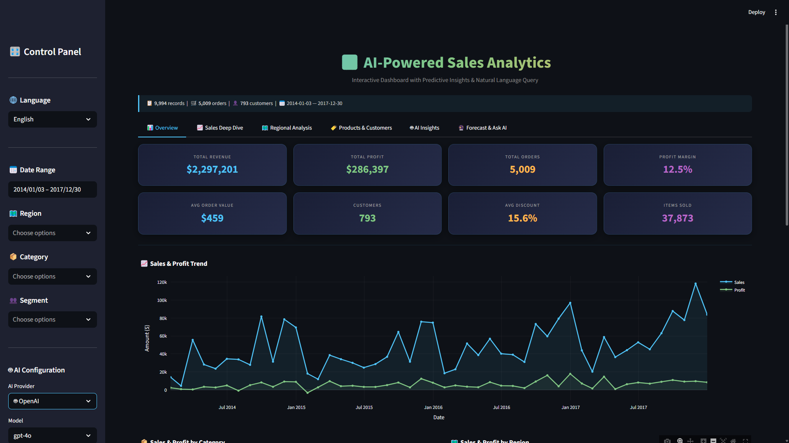
<br>
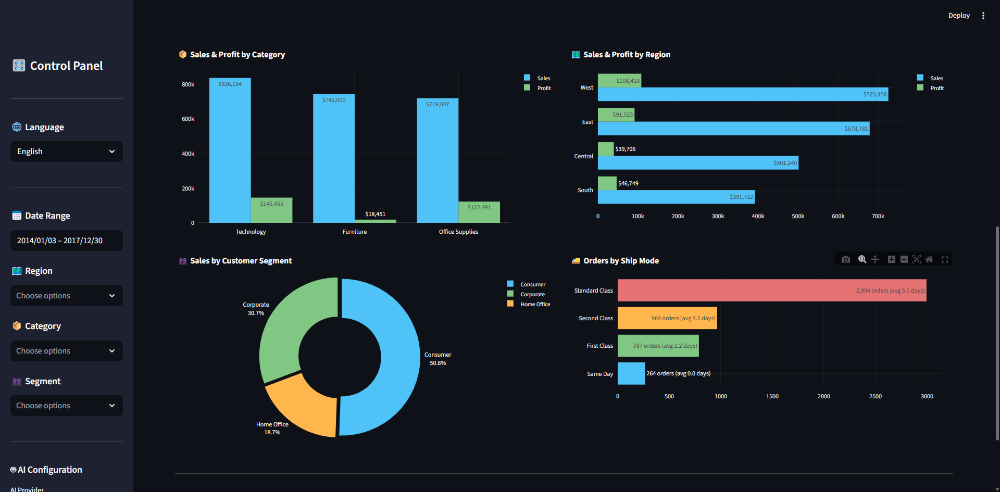
</details>

<details>
<summary><b>📈 深度分析 — 年度同比 + 折扣影响 + 子类别利润</b></summary>
<br>
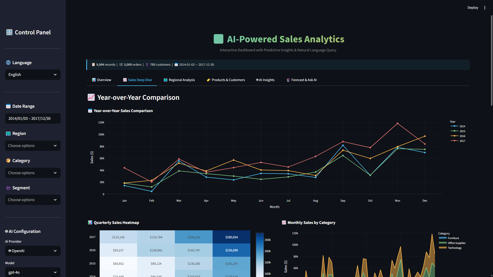
<br>
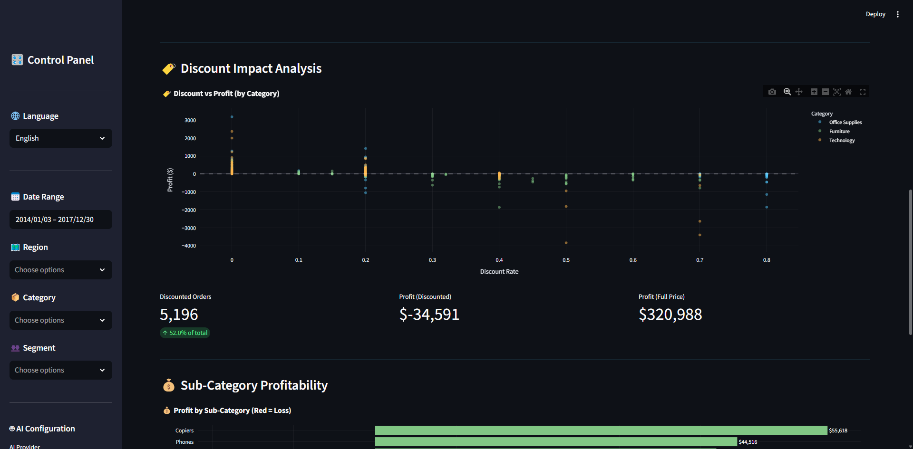
<br>
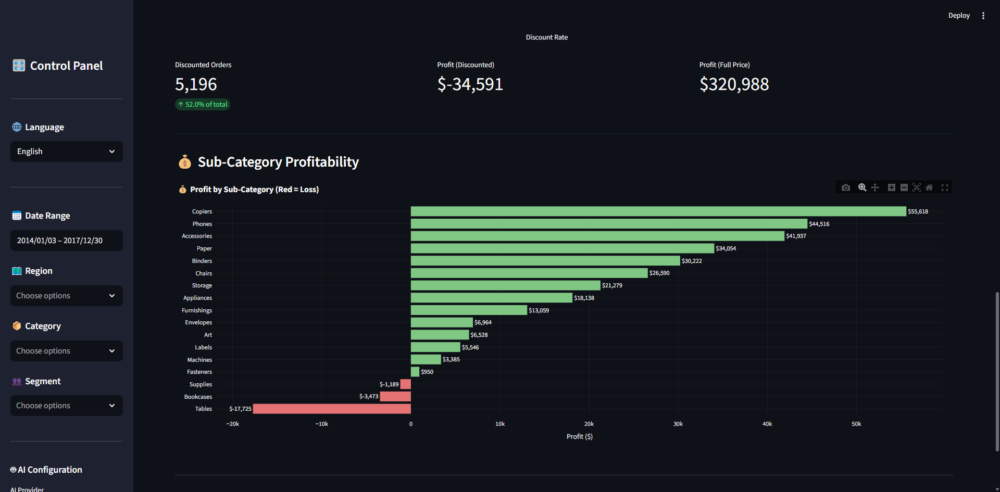
</details>

<details>
<summary><b>🗺️ 区域分析 — 州级热力地图 + Top 州/城市</b></summary>
<br>
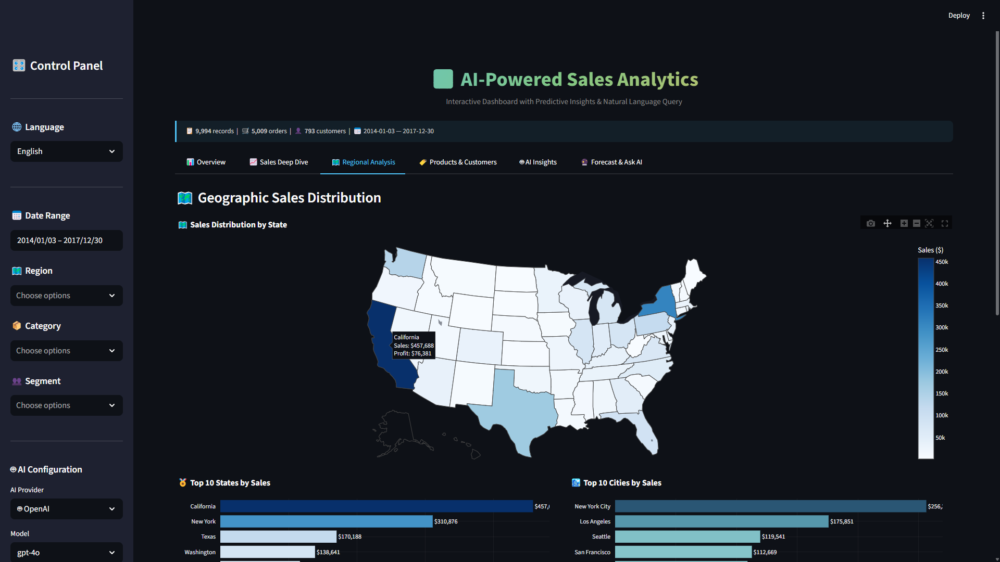
</details>

<details>
<summary><b>👥 产品与客户 — 细分与行为分析</b></summary>
<br>
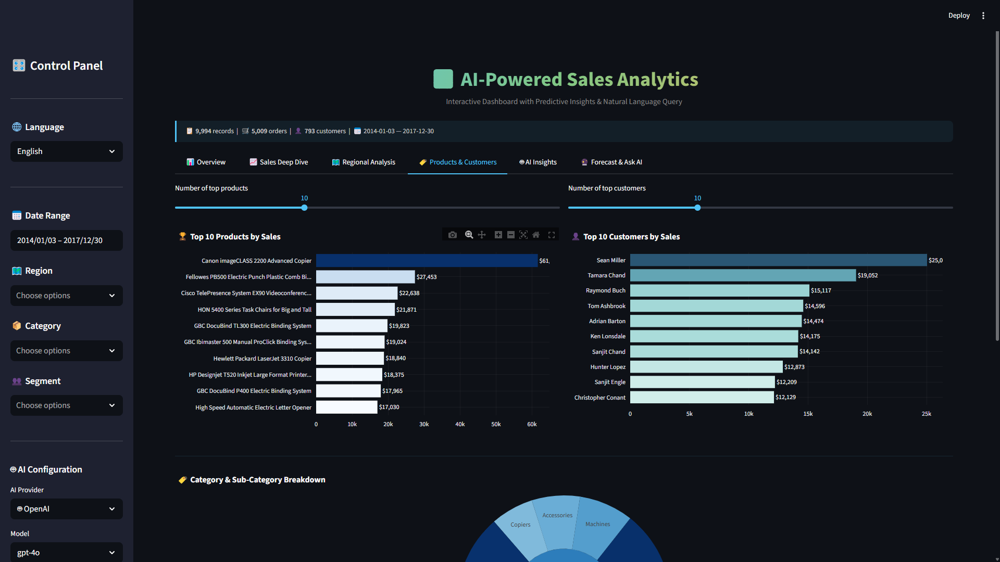
</details>


<details>
<summary><b>🤖 AI 洞察 — LLM 驱动的管理层分析报告</b></summary>
<br>
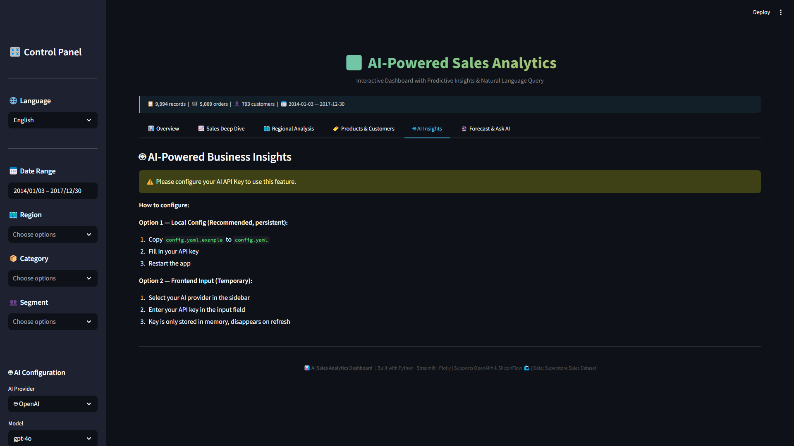
<br>

<br>
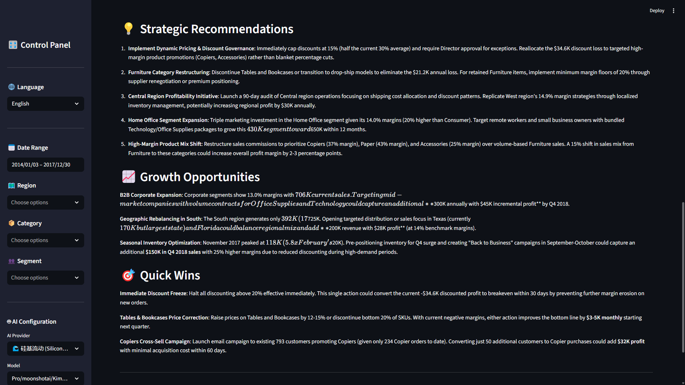
</details>

<details>
<summary><b>🔮 预测 — 时间序列预测与置信区间</b></summary>
<br>
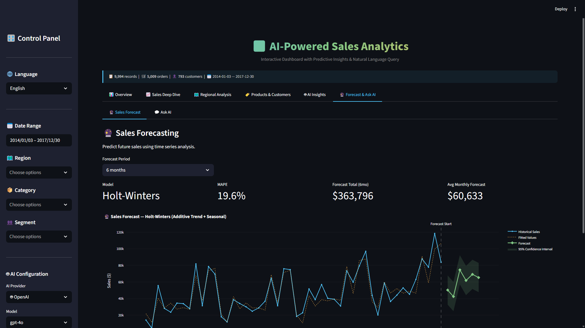
</details>

<details>
<summary><b>🧠 询问AI — 自然语言查询</b></summary>
<br>
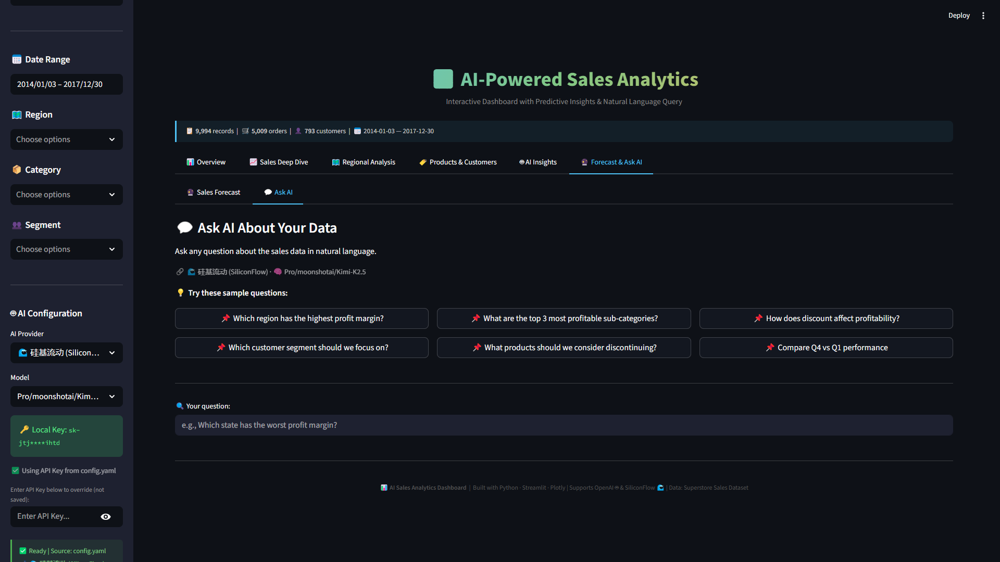
<br>
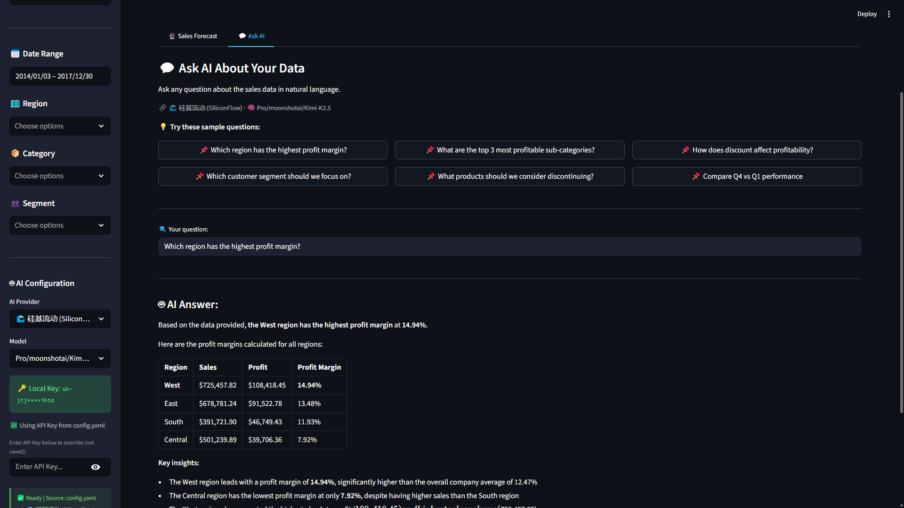
</details>

<details>
<summary><b>🌐 双语切换 — 无缝中英文界面</b></summary>
<br>

</details>

---

## 🚀 快速开始

### 环境要求

- Python 3.10+（已在 3.12 测试通过）
- [Superstore Sales Dataset](https://www.kaggle.com/datasets/vivek468/superstore-dataset-final)

### 5 分钟启动

```bash
# 克隆 & 配置环境
git clone https://github.com/yourusername/ai-sales-analytics.git
cd ai-sales-analytics

conda create -n sales-analytics python=3.12 -y
conda activate sales-analytics
pip install -r requirements.txt

# 数据 — 从 Kaggle 下载，保存为：
# → data/sales_data.csv

# AI 配置（可选 — 不配也能用仪表盘）
cp config.yaml.example config.yaml
# 编辑 config.yaml 填入 API Key

# 启动
streamlit run app.py
```

### 最简 AI 配置

```yaml
# config.yaml
default_provider: "siliconflow"

siliconflow:
  api_key: "sk-你的密钥"
  base_url: "https://api.siliconflow.cn/v1"
  model: "Pro/deepseek-ai/DeepSeek-V3.2"
```

> 💡 所有可视化和预测功能 **无需 API Key**。仅 AI 洞察和 AI 问答需要。

---

## 📁 项目结构

```
ai-sales-analytics/
├── app.py                      # 主应用入口
├── config.yaml                 # API 凭证（已加入 .gitignore）
├── config.yaml.example         # 配置模板
├── requirements.txt            # 依赖
│
├── data/
│   └── sales_data.csv          # 数据源
│
├── locales/                    # BCP 47 国际化语言包
│   ├── en.json                 # 英文
│   └── zh-CN.json              # 简体中文
│
├── modules/
│   ├── i18n.py                 # 国际化引擎（JSON 加载 + 回退）
│   ├── config_manager.py       # 多服务商 API 管理
│   ├── data_loader.py          # ETL 与特征工程
│   ├── visualizations.py       # 15+ Plotly 图表组件
│   ├── ai_insights.py          # LLM 集成层
│   └── forecasting.py          # Holt-Winters 预测
│
├── .streamlit/
│   └── config.toml             # 主题配置
│
├── docs/images/                # 截图
└── .gitignore
```

---

## 🛠️ 技术栈

| 层级 | 技术 | 用途 |
|------|------|------|
| **界面** | Streamlit | 交互式 Web 应用 |
| **图表** | Plotly | 15+ 交互式可视化类型 |
| **数据** | Pandas, NumPy | ETL、分析、特征工程 |
| **预测** | statsmodels | Holt-Winters 指数平滑 |
| **AI/LLM** | OpenAI SDK | 多服务商 LLM 集成 |
| **国际化** | 自研引擎 | BCP 47 JSON 语言包 |
| **配置** | PyYAML | 安全凭证管理 |

### 支持的 AI 服务商

| 服务商 | 核心模型 | 备注 |
|--------|----------|------|
| 🌊 **硅基流动** | DeepSeek-V3.2, Kimi-K2.5, MiniMax-M2.5 | 部分模型有免费额度 |
| 🤖 **OpenAI** | GPT-4o, GPT-4o-mini | 按量付费 |
| 🔌 **任何 OpenAI 兼容接口** | 自定义端点 | 可配置 base_url |

---

## 🌐 添加新语言

无需修改任何代码：

```bash
cp locales/en.json locales/ja.json
# 编辑 ja.json → 重启 → 完成
```

### 当前国际化覆盖范围

| 范围 | 已覆盖 |
|------|:------:|
| 界面标签、按钮、标题 | ✅ |
| 图表标题与坐标轴 | ✅ |
| KPI 卡片标签 | ✅ |
| AI 提示词模板 | ✅ |
| AI 回复语言 | ✅ |
| 示例问题 | ✅ |
| 错误提示 | ✅ |

---

## 🗺️ 发展路线图

- [x] 15+ 图表的交互式仪表盘
- [x] AI 驱动的商业洞察（多服务商）
- [x] 时间序列预测（Holt-Winters）
- [x] 自然语言数据查询
- [x] 双语界面（英 / 中）
- [x] 标准 JSON 国际化系统
- [x] 安全的多服务商 API 管理
- [ ] PDF/Excel 报告导出
- [ ] RAG 文档问答
- [ ] 多数据集 / 自定义 CSV 上传
- [ ] 用户认证与权限控制
- [ ] Streamlit Cloud / Docker 部署
- [ ] 邮件定时报告

---

## 🤝 关于本项目

### 开发方法

本项目采用 **现代 AI 增强开发工作流** 进行架构设计与交付：

| 职责 | 角色 |
|------|------|
| 产品愿景与业务需求 | **人（方案架构师）** |
| 系统架构与技术决策 | **人** |
| UX/UI 设计决策 | **人** |
| 代码实现 | **AI 辅助**（Claude, Anthropic） |
| 质量保证与集成测试 | **人** |
| 部署与文档 | **协作完成** |

优势在于 **知道该构建什么**，而非仅仅会敲键盘。

### 关于作者

**[Jason]** — AI 解决方案架构师 & 技术创始人

拥有 Python、Java、PHP、Vue.js、IoT 及移动开发的全栈技术背景。曾创办科技公司，在产品设计、系统架构与端到端交付方面拥有一线实战经验。

我帮助企业将想法转化为 AI 生产级解决方案 — 从初始架构到最终部署。

**擅长领域：** AI/LLM 集成 · 数据分析与 BI · 物联网系统 · 全栈架构

[Email](wojingchen@gmail.com)

---

## 📄 许可证

MIT 许可证 — 详见 [LICENSE](LICENSE)。

**数据来源：** [Superstore Sales Dataset](https://www.kaggle.com/datasets/vivek468/superstore-dataset-final)（Kaggle/Tableau，教育用途）。

---

<div align="center">

**以战略眼光架构，以 AI 增强效率交付 ⚡**

[⬆ 返回顶部](#-ai-智能销售分析平台)

</div>